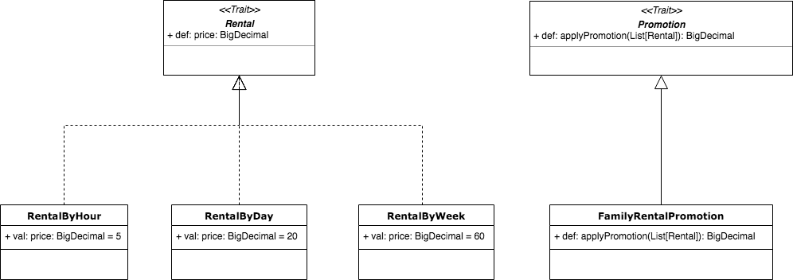

> Scala Bike Rental Example

##### The problem
A company rents bikes under following options:

1. Rental by hour, charging $5 per hour
2. Rental by day, charging $20 a day
3. Rental by week, changing $60 a week
4. Family Rental, is a promotion that can include from 3 to 5 Rentals (of any type) with a discount of 30% of the total price

##### Assigment:

1. Implement a set of classes to model this domain and logic
2. Add automated tests to ensure a coverage over 85%
3. Use GitHub to store and version your code
4. Apply all the recommended practices you would use in a real project
5. Add a README.md file to the root of your repository to explain: your design, the development practices you applied and how run the tests.

##### Design
The approach used to solve this problem consists one simple module named RentalModule. This module
contains two primary traits: Rental and Promotion. Rental has information about every rental operation
and promotion operates over a List of rentals. Other classes included in RentalModule are implementations
of the Rental and Promotion traits.

##### Development practices
Basically I used TDD to solve this problem and I designed the solution thinking in re-usability and 
easy extension of the classes.

##### Running the test
To run the tests, we can use the following command from the root folder of the project:

`sbt test`   

 